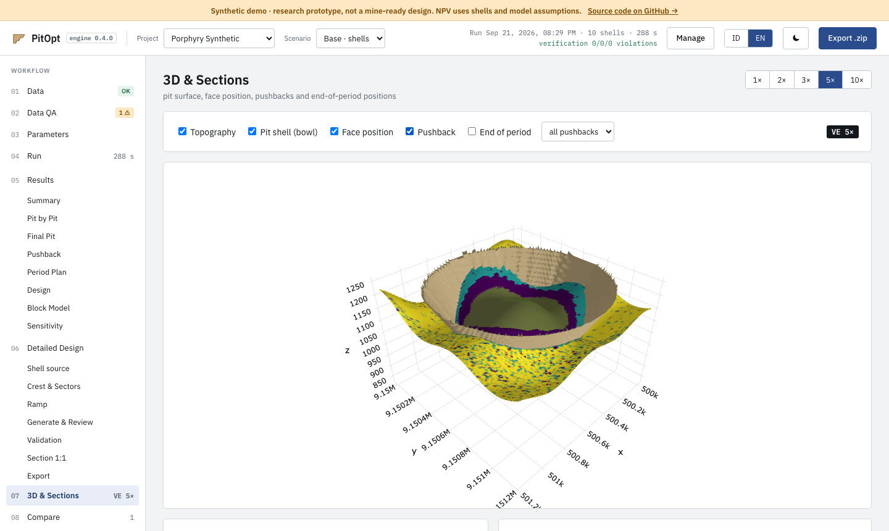

# PitOpt

**Open-source open-pit mine planning — from block model to benched pit design.**

[](https://github.com/ghoziankarami/pitopt/actions/workflows/ci.yml)
[](LICENSE)
[](https://www.python.org/downloads/)
[](https://pitopt.orebit.id)

PitOpt takes a block model (CSV) and a topography surface (DXF) and produces
nested revenue-factor shells, a discounted pit-by-pit analysis, the final pit
chosen on NPV, pushbacks, a period-by-period mine plan, a benched pit design
with ramps, and price sensitivity — as Excel and PDF reports, DXF surfaces and
an interactive 3D viewer. It runs on your own computer; your data never leaves it.


**[Try the live demo →](https://pitopt.orebit.id)** (synthetic data, read-only, no sign-up)
&nbsp;·&nbsp; **[Install it in 3 minutes →](#install)**

## Features

- **Exact ultimate-pit optimisation.** Every shell is a maximum closure solved
  with NetworkX preflow-push, cross-checked against an unrelated max-flow
  solver and brute force.
- **Strategic workflow.** Nested RF shells, pit-by-pit with best/worst-case NPV,
  final pit selection, pushbacks, a capacity-constrained schedule and price
  sensitivity.
- **Detailed design.** Benches, berms and ramps per geotechnical sector, with
  validation against inter-ramp and overall slope limits and reconciliation to
  the optimised shell.
- **Your data, as delivered.** Map any CSV column names (Surpac, Datamine,
  Vulcan, GEMS, Leapfrog exports); multi-product and by-product economics;
  `pitopt reblock` regularises sub-celled models.
- **Web UI and CLI.** A local browser app in English or Indonesian, a `pitopt`
  command for scripting, and an optional MCP server.

<details>
<summary>More screenshots</summary>



</details>

## Install

You need **Python 3.10 or newer** and **Git**. Check with `python3 --version`.
The stock `python3` on macOS is 3.9 — install a newer one from
[python.org](https://www.python.org/downloads/) or with `brew install python`.

**macOS / Linux** — paste into a terminal:

```bash
git clone https://github.com/ghoziankarami/pitopt.git && cd pitopt && bash PitOpt.command
```

**Windows** — PitOpt runs in [WSL 2](https://learn.microsoft.com/en-us/windows/wsl/install)
(Ubuntu). In the Ubuntu terminal:

```bash
sudo apt update && sudo apt install -y git python3-venv && git clone https://github.com/ghoziankarami/pitopt.git && cd pitopt && bash scripts/start_ui.sh
```

The first launch creates a local `.venv`, installs PitOpt, runs the bundled
synthetic examples and opens <http://127.0.0.1:8765>. It takes a few minutes
once; later launches start in seconds. Keep the terminal open while you use the
app and press **Ctrl+C** to stop it. To start it again later, run
`bash PitOpt.command` (macOS/Linux) or `bash scripts/start_ui.sh` (WSL) from the
`pitopt` folder.

No Git? [Download the ZIP](https://github.com/ghoziankarami/pitopt/archive/refs/heads/main.zip),
extract it and double-click `PitOpt.command` (macOS). More options and
troubleshooting: [docs/INSTALLATION.md](docs/INSTALLATION.md).

## Use it

**With your own data:** in the app, open **Manage → New project**, upload a
block model (CSV) and optionally a topography (DXF or CSV XYZ). The wizard
detects coordinate columns and block size, asks for prices, costs, recoveries
and slopes, and marks every value you did not enter as an assumption.

**From the command line:**

```bash
source .venv/bin/activate
pitopt validate --config projects/example_tin/project.yaml   # checks files, prints the cutoff grade
pitopt run      --config projects/example_tin/project.yaml   # writes reports to outputs/example_tin/
pitopt ui                                                   # the web app
```

Copy `projects/example_tin/` to start your own project; its `project.yaml` is
the fully commented template.

## Documentation

| Document | Contents |
|---|---|
| [INSTALLATION.md](docs/INSTALLATION.md) | Install options, troubleshooting, optional extras |
| [TECHNICAL.md](docs/TECHNICAL.md) | Outputs, configuration, block valuation, workflow, design, verification, model size, CLI and MCP reference |
| [METODOLOGI.md](docs/METODOLOGI.md) | Calculation rules end to end with a worked example (Indonesian) |
| [RELEASE_AUDIT.md](docs/RELEASE_AUDIT.md) | Release audit and known numerical limitations |
| [PRD.md](docs/PRD.md) | Product requirements for the app |

## Scope and limitations

PitOpt is a strategic planning and research prototype. The closure solve is
exact; what is approximate is everything around it — the slope template, flat
costs, one process destination, a schedule that follows a specified sequence
rather than optimising every block, and in-memory graphs that limit models to
the low hundreds of thousands of blocks. An optimum of the discrete graph is
**not** a certified resource or reserve estimate, a geotechnically approved pit
or an optimal production schedule. Read
[What this is not](docs/TECHNICAL.md#what-this-is-not) before taking a number
to a study.

## Contributing

Bug reports, ideas and pull requests are welcome — see
[CONTRIBUTING.md](CONTRIBUTING.md) and the [Code of Conduct](CODE_OF_CONDUCT.md).
Report security issues privately as described in [SECURITY.md](SECURITY.md).
If PitOpt is useful to you, a ⭐ on GitHub helps others find it.

## License and citation

PitOpt is released under the [MIT License](LICENSE). Bundled fonts (OFL-1.1)
and MineLib benchmark files (CC BY-SA 3.0) keep their own licenses; see
[THIRD_PARTY_NOTICES.md](THIRD_PARTY_NOTICES.md). If you use PitOpt in research,
please cite it using [CITATION.cff](CITATION.cff) (GitHub's "Cite this
repository" button).
